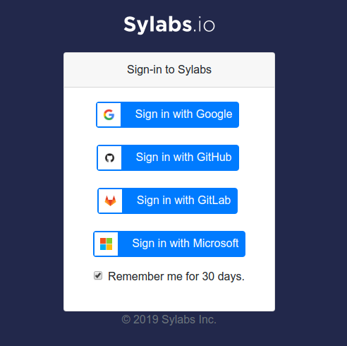

# Prerequisites
An unprivileged user is not allowed to build a container image on any OSC login
or computing nodes. To continue hands-on exercises, please install Singularity
on your laptop. If you have any difficulty in performing this installation, you
can use remote-build function after signing up Sylabs Cloud Services. However
it is more complicated to put your local files into a container.

## Install Singularity
For Linux users, you can follow [the installation
instruction](https://www.sylabs.io/guides/3.1/user-guide/installation.html#install-on-linux)
from Singularity user guide.

For macOS and Windows users, a Ubuntu-based virtual machine image with
pre-installed Singularity is avaiable from [here]. Please use [VirtualBox
5.2](https://www.virtualbox.org/wiki/Download_Old_Builds_5_2) and follow [this
instruction](https://docs.oracle.com/cd/E26217_01/E26796/html/qs-import-vm.html)
to import a VM to an applicane. Alternatively you can follow [the installation
instruction](https://www.sylabs.io/guides/3.1/user-guide/installation.html#install-on-windows-or-mac)
from Singularity user guide.

## Sylabs Cloud Services
[Sylabs Cloud Services](https://cloud.sylabs.io/home) support cotainer build,
sharing, signing and validation.

### Sign up Sylabs Cloud Serivce
Sylabs support several sign-up options. GitHub or GitLab are recommended.

### Create a access token to authenticate with Sylabs services
Click __Account__ | __Access Tokens__ and then enter a label for a new access
token. Put the token into a file in your home directory named
`~/.singularity/sylabs-token`.
